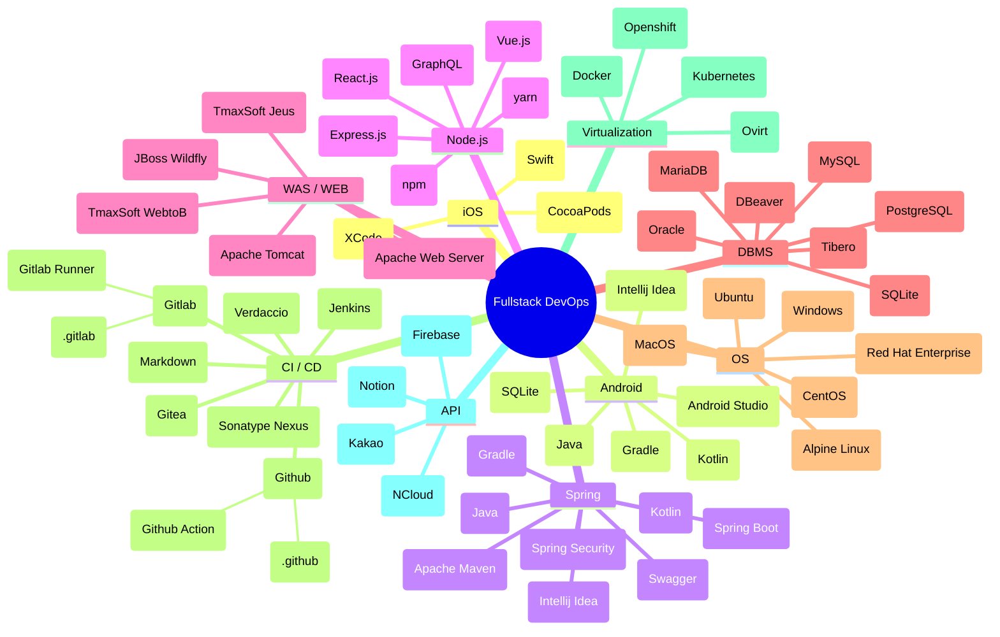
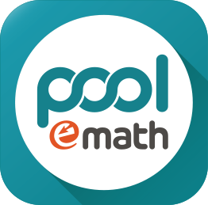

# chanhi2000

![img][img]

프로그램이 작성되는 환경부터 배포되는 환경까지 좋은 문화를 적용하는 개발자 이찬희 입니다

---

## My Skills

<!-- my-skils -->

| Property | Data |
| :--- | :--- |
| :rocket: Language / Tools / IDE / Framework | ![shield-xcode][shield-xcode] ![shield-swift][shield-swift] ![shield-cocoapods][shield-cocoapods] ![shield-jetbrains][shield-jetbrains] ![shield-intellijidea][shield-intellijidea] ![shield-androidstudio][shield-androidstudio] ![shield-eclipse][shield-eclipse] ![shield-java][shield-java] ![shield-kotlin][shield-kotlin] ![shield-android][shield-android] ![shield-spring][shield-spring] ![shield-spring-boot][shield-spring-boot] ![shield-spring-security][shield-spring-security] ![shield-swagger][shield-swagger] ![shield-apache-maven][shield-apache-maven] ![shield-apache-ant][shield-apache-ant] ![shield-gradle][shield-gradle] ![shield-apache-tomcat][shield-apache-tomcat]  ![shield-vscode][shield-vscode] ![shield-vscodium][shield-vscodium] ![shield-npm][shield-npm] ![shield-yarn][shield-yarn] ![shield-html][shield-html] ![shield-nodejs][shield-nodejs] ![shield-jquery][shield-jquery] ![shield-javascript][shield-javascript] ![shield-typescript][shield-typescript] ![shield-express][shield-express] ![shield-apache-cordova][shield-apache-cordova] ![shield-reactjs][shield-reactjs] ![shield-vue-js][shield-vue-js] ![shield-graphql][shield-graphql] ![shield-css][shield-css]  ![shield-visualstudio][shield-visualstudio] ![shield-csharp][shield-csharp] ![shield-dotnet][shield-dotnet]   ![shield-cpp][shield-cpp] ![shield-c][shield-c]   ![shield-gnu-bash][shield-gnu-bash] ![shield-vim][shield-vim] ![shield-neovim][shield-neovim] ![shield-pwsh][shield-pwsh] |
| :truck: CI / CD | ![shield-subversion][shield-subversion] ![shield-git][shield-git]  ![shield-github][shield-github] ![shield-github-action][shield-github-action] ![shield-gitlab][shield-gitlab] ![shield-gitea][shield-gitea]   ![shield-jenkins][shield-jenkins] ![shield-verdaccio][shield-verdaccio]   ![shield-markdown][shield-markdown] ![shield-readme][shield-readme] |
|	:mag_right: Databases | ![shield-mysql][shield-mysql] ![shield-mariadb][shield-mariadb] ![shield-sqlite][shield-sqlite] ![shield-oracle][shield-oracle] ![shield-postgresql][shield-postgresql] |
| :desktop_computer: OS | ![shield-macos][shield-macos] ![shield-win][shield-win] ![shield-ubuntu][shield-ubuntu] ![shield-centos][shield-centos] ![shield-redhat][shield-redhat] ![shield-alpine-linux][shield-alpine-linux] |
| :ship: Virtualization | ![shield-virtualbox][shield-virtualbox] ![shield-vmware][shield-vmware] ![shield-docker][shield-docker] ![shield-kubernetes][shield-kubernetes] ![shield-openshift][shield-openshift] |
| :cloud: Cloud | |
| :vertical_traffic_light: API Used | ![shield-firebase][shield-firebase] ![shield-kakao][shield-kakao] ![shield-naver][shield-naver] ![shield-notion][shield-notion] |
| Misc. | ![shield-notion][shield-notion] ![shield-postman][shield-postman] ![shield-synology][shield-synology] ![shield-curl][shield-curl] |

See Mindmap of My Skllsets
 

  

---

## 🔭 I’m currently working on

- Making Portfolio Page on [][notion-portfolio]
- 모바일 온나라 앱 유지보수

Building + refining mock app(s) for iOS / Android
 

- [chanhi2000/facebookFeed][facebookFeed]
- [chanhi2000/youtube-ios][youtube-ios]
- [chanhi2000/nike-detail-ios][nike-detail-ios]
- [chanhi2000/IngrediSearch][IngrediSearch]

Developing Docker image for myself and project(s)
 

  

- [chanhi2000/tibero-docker][tibero-docker]

(2018-2021) in <em><b>G-inno System</b></em>
 

  
  
  
  
  
  

- (2018-2019) 서울시 포장도로 관리 시스템 모바일부분 유지보수 용역
  - Daum 맵 위치정보 기반 멀티플랫폼 프로젝트
  - 네이티브 앱(Android / iOS) + Spring기반 중계서버 개발+배포 담당
  - [][spms-ios][][spms-android]
- (2019-2020) 서울시 포장도로 관리 시스템 유지보수 용역
  - ArcGis 기반 공간정보 프로젝트
  - Spring기반 프론트/백엔드 개발+배포 담당 
  - ArcGis 기반 지도데이터 갱신
- (2019-2020) 서울 스마트재난 시스템 유지보수 용역 - _서울안전 (대시민)_
  - NCloud 맵 위치정보 기반 멀티플랫폼 프로젝트
  - 하이브리드 앱 (Cordova) + Spring기반 웹/모바일 프론트/백엔드 개발+배포 담당
  - [][safecity-ios][][safecity-android]
  - [서울안전누리 사이트][toSafecity]
- (2019-2020) 서울 스마트재난 시스템 유지보수 용역 - _통합재난시스템 (내부)_
- (2020) 행정안전부 통합상황시스템 모바일 신규 사업
- (2021) LG CNS 차세대 사회보장 시스템 GIS 부분 개발

  
(2021-2022) in <em><b>Poole Learning</b></em>
 
  

    
    
  

- (2021-2022) 자사 앱 개발 및 관리 
  - __풀이수학__: (중.고등) 수학 외 기타과목 문제지 (Web/PDF 기반) 풀이 및 필기 서비스
  - __수식입력기__: LaTeX기반 수식 변환 전용
  - __어드민__: 수학 문제지 문제 등록/수정/기타 관리용
- (2021) 해법교육 수학 AppBook 개발 및 외주 프로젝트 용역 : 안드로이드 및 서버 개발관리
  - 테스트 환경 API 서버 관리 (Node 기반)
  - (초.중.고등) PDF기반 풀이 및 필기 서비스

  
(2022-current) in <em><b>URP Consortium</b></em>
 
  

    
    
    
    
  

- 2022-2023년 정부업무관리시스템(온나라 문서) 및 정부전자문서유통지원센터 유지관리 사업
  - 온나라 문서 모바일 앱 (`v1.0`/`v2.0`)
  - 온나라 문서 모바일용 중계서버 (`v1.0`/`v2.0`)
  - 온나라 문서 모바일용 결재서버 (`v1.0`/`v2.0`)
  - 기타 툴 (API 및 웹서비스 테스팅, SSO로그인 검증, etc.)
  - 모바일서비스팀 총괄

### 🌱 I’m currently learning ...

<!--
### 👯 I’m looking to collaborate on ...

### 🤔 I’m looking for help with ...

### 💬 Ask me about ...

### ⚡ Fun fact: ...
-->
### 📫 How to reach me

- I am open for collaborations, so if you find my work interesting feel free to send me a message! Even if you don't, send me a message anyway! Here is where you can reach me

  
  
  
  
  

## Github Stats

![chanhi2000's github stats][github-stats]

![chanhi2000's most used languages][github-stats-most-used-lang]

---

[shield-swift]: https://img.shields.io/badge/Swift-FA7343?logo=swift&logoColor=white&style=flat-square
[shield-xcode]: https://img.shields.io/badge/Xcode-1575F9?logo=Xcode&logoColor=white&style=flat-square
[shield-cocoapods]: https://img.shields.io/badge/CocoaPods-EE3322?logo=CocoaPods&logoColor=white&style=flat-square

[shield-jetbrains]: https://img.shields.io/badge/Jetbrains-000000?logo=jetbrains&logoColor=white&style=flat-square
[shield-intellijidea]: https://img.shields.io/badge/Intellij%20Idea-000000?logo=intellijidea&logoColor=white&style=flat-square
[shield-androidstudio]: https://img.shields.io/badge/Android%20Studio-3DDC84?logo=androidstudio&logoColor=white&style=flat-square
[shield-eclipse]: https://img.shields.io/badge/Eclipse-2C2255?logo=eclipseide&logoColor=white&style=flat-square 
[shield-java]: https://img.shields.io/badge/Java-007396?logo=openjdk&logoColor=white&style=flat-square
[shield-kotlin]: https://img.shields.io/badge/Kotlin-0095D5?logo=kotlin&logoColor=white&style=flat-square
[shield-android]: https://img.shields.io/badge/Android-3DDC84?logo=android&logoColor=white&style=flat-square
[shield-spring]: https://img.shields.io/badge/Spring-6DB33F?logo=Spring&logoColor=white&style=flat-square
[shield-spring-boot]: https://img.shields.io/badge/Spring%20Boot-6DB33F?logo=Springboot&logoColor=white&style=flat-square
[shield-spring-security]: https://img.shields.io/badge/Spring%20Security-6DB33F?logo=Springsecurity&logoColor=white&style=flat-square
[shield-swagger]: https://img.shields.io/badge/Swagger-85EA2D?logo=swagger&logoColor=white&style=flat-square
[shield-apache-maven]: https://img.shields.io/badge/Apache%20Maven-C71A36?logo=apachemaven&logoColor=white&style=flat-square
[shield-apache-ant]: https://img.shields.io/badge/Apache%20Ant-A81C7D?logo=apacheant&logoColor=white&style=flat-square
[shield-gradle]: https://img.shields.io/badge/Gradle-02303A?logo=gradle&logoColor=white&style=flat-square
[shield-apache-tomcat]: https://img.shields.io/badge/Apache%20Tomcat-F8DC75?logo=apachetomcat&logoColor=white&style=flat-square 

[shield-vscode]: https://img.shields.io/badge/Visual%20Studio%20Code-007ACC?logo=visualstudiocode&logoColor=white&style=flat-square
[shield-vscodium]: https://img.shields.io/badge/VSCodium-2F80ED?logo=vscodium&logoColor=white&style=flat-square
[shield-npm]: https://img.shields.io/badge/npm-CB3837?logo=npm&logoColor=white&style=flat-square
[shield-yarn]: https://img.shields.io/badge/yarn-2C8EBB?logo=yarn&logoColor=white&style=flat-square
[shield-html]: https://img.shields.io/badge/HTML-E34F26?logo=html5&logoColor=white&style=flat-square
[shield-jquery]: https://img.shields.io/badge/jQuery-0769AD?logo=jQuery&logoColor=white&style=flat-square
[shield-nodejs]: https://img.shields.io/badge/Node.js-339933?logo=nodedotjs&logoColor=white&style=flat-square
[shield-javascript]: https://img.shields.io/badge/Javascript-F7DF1E?logo=javascript&logoColor=white&style=flat-square
[shield-typescript]: https://img.shields.io/badge/Typescript-3178C6?logo=typescript&logoColor=white&style=flat-square
[shield-express]: https://img.shields.io/badge/Express-000000?logo=express&logoColor=white&style=flat-square
[shield-apache-cordova]: https://img.shields.io/badge/Apache%20Cordova-E8E8E8?logo=Apache%20Cordova&logoColor=white&style=flat-square
[shield-reactjs]: https://img.shields.io/badge/React.js-61DAFB?logo=react&logoColor=white&style=flat-square
[shield-vue-js]: https://img.shields.io/badge/Vue.js-4FC08D?logo=vuedotjs&logoColor=white&style=flat-square
[shield-graphql]: https://img.shields.io/badge/GraphQL-E10098?logo=GraphQL&logoColor=white&style=flat-square
[shield-css]: https://img.shields.io/badge/css3-1572B6?logo=css3&logoColor=white&style=flat-square

[shield-visualstudio]: https://img.shields.io/badge/Visual%20Studio-5C2D91?logo=visualstudio&logoColor=white&style=flat-square
[shield-csharp]: https://img.shields.io/badge/C%20Sharp-239120?logo=csharp&logoColor=white&style=flat-square
[shield-dotnet]: https://img.shields.io/badge/.Net%20Core-5C2D91?logo=dotnet&logoColor=white&style=flat-square
[shield-cpp]: https://img.shields.io/badge/C++-00599C?logo=cplusplus&logoColor=white&style=flat-square
[shield-c]: https://img.shields.io/badge/C-A8B9CC?logo=c&logoColor=white&style=flat-square

[shield-gnu-bash]: https://img.shields.io/badge/GNU%20Bash-4EAA25?logo=gnubash&logoColor=white&style=flat-square
[shield-vim]: https://img.shields.io/badge/Vim-019733?logo=vim&logoColor=white&style=flat-square
[shield-neovim]: https://img.shields.io/badge/Neovim-57A143?logo=neovim&logoColor=white&style=flat-square
[shield-pwsh]: https://img.shields.io/badge/Powershell-5391FE?logo=powershell&logoColor=white&style=flat-square

[shield-subversion]: https://img.shields.io/badge/Subversion-809CC9?logo=Subversion&logoColor=white&style=flat-square
[shield-git]: https://img.shields.io/badge/Git-F05032?logo=git&logoColor=white&style=flat-square
[shield-github]: https://img.shields.io/badge/Github-181717?logo=github&logoColor=white&style=flat-square
[shield-github-action]: https://img.shields.io/badge/Github%20Actions-2088FF?logo=githubactions&logoColor=white&style=flat-square
[shield-gitlab]: https://img.shields.io/badge/Gitlab-FC6D26?logo=gitlab&logoColor=white&style=flat-square
[shield-gitea]: https://img.shields.io/badge/Gitea-609926?logo=Gitea&logoColor=white&style=flat-square
[shield-jenkins]: https://img.shields.io/badge/Jenkins-D24939?logo=jenkins&logoColor=white&style=flat-square
[shield-markdown]: https://img.shields.io/badge/Markdown-000000?logo=jenkins&logoColor=white&style=flat-square
[shield-readme]: https://img.shields.io/badge/ReadMe-018EF5?logo=readme&logoColor=white&style=flat-square
[shield-verdaccio]: https://img.shields.io/badge/Verdaccio-4B5E40?logo=verdaccio&logoColor=white&style=flat-square

[shield-mysql]: https://img.shields.io/badge/MySQL-4479A1?logo=mysql&logoColor=white&style=flat-square
[shield-mariadb]: https://img.shields.io/badge/MariaDB-003545?logo=MariaDB&logoColor=white&style=flat-square
[shield-sqlite]: https://img.shields.io/badge/SQLite-003B57?logo=sqlite&logoColor=white&style=flat-square
[shield-oracle]: https://img.shields.io/badge/Oracle-F80000?logo=oracle&logoColor=white&style=flat-square
[shield-postgresql]: https://img.shields.io/badge/PostgreSQL-4169E1?logo=postgresql&logoColor=white&style=flat-square

[shield-macos]: https://img.shields.io/badge/macOS-000000?logo=apple&logoColor=white&style=flat-square
[shield-win]: https://img.shields.io/badge/Windows-0078D6?logo=windows&logoColor=white&style=flat-square
[shield-ubuntu]: https://img.shields.io/badge/Ubuntu-E95420?logo=ubuntu&logoColor=white&style=flat-square
[shield-centos]: https://img.shields.io/badge/CentOS-262577?logo=centos&logoColor=white&style=flat-square
[shield-redhat]: https://img.shields.io/badge/Red%20Hat-EE0000?logo=redhat&logoColor=white&style=flat-square
[shield-alpine-linux]: https://img.shields.io/badge/Alpine%20Linux-E95420?logo=alpinelinux&logoColor=white&style=flat-square

[shield-virtualbox]: https://img.shields.io/badge/Virtualbox-183A61?logo=virtualbox&logoColor=white&style=flat-square
[shield-vmware]: https://img.shields.io/badge/VMWare-607078?logo=vmward&logoColor=white&style=flat-square
[shield-docker]: https://img.shields.io/badge/Docker-2496ED?logo=docker&logoColor=white&style=flat-square
[shield-kubernetes]: https://img.shields.io/badge/Kubernetes-326CE5?logo=Kubernetes&logoColor=white&style=flat-square
[shield-openshift]: https://img.shields.io/badge/Openshift-EE0000?logo=redhatopenshift&logoColor=white&style=flat-square

[shield-firebase]: https://img.shields.io/badge/Firebase%20API-FFCA28?logo=Firebase&logoColor=white&style=flat-square
[shield-kakao]: https://img.shields.io/badge/Kakao%20API-FFCD00?logo=Kakao&logoColor=white&style=flat-square
[shield-naver]: https://img.shields.io/badge/NCloud-03C75A?logo=naver&logoColor=white&style=flat-square

[shield-notion]: https://img.shields.io/badge/Notion-000000?logo=Notion&logoColor=white&style=flat-square
[shield-postman]: https://img.shields.io/badge/Postman-FF6C37?logo=Postman&logoColor=white&style=flat-square
[shield-synology]: https://img.shields.io/badge/Synology%20NAS-B6B5B6?logo=synology&logoColor=white&style=flat-square
[shield-curl]: https://img.shields.io/badge/curl-073551?logo=curl&logoColor=white&style=flat-square

[img]: imgs/coderman.gif
[spms-ios]: https://pavepot.eseoul.go.kr:8443/ios.do
[spms-android]: http://115.84.164.38:8080/apk/SPMS.apk
[safecity-ios]: https://apps.apple.com/kr/app/%EC%84%9C%EC%9A%B8%EC%95%88%EC%A0%84/id1331810063
[safecity-android]: https://play.google.com/store/apps/details?id=kr.go.seoul.hybrid.SafeCity
[toSafecity]: https://safecity.seoul.go.kr
[github-stats]: https://github-readme-stats.vercel.app/api?username=chanhi2000
[github-stats-most-used-lang]: https://github-readme-stats.vercel.app/api/top-langs/?username=chanhi2000&layout=compact
[notion-portfolio]: https://www.notion.so/MarkiiimarK-c231ae6c157d4baba89a3713c92449dd
[github-page]: https://chanhi2000.github.io

[facebookFeed]: https://github.com/chanhi2000/facebookFeed
[youtube-ios]: https://github.com/chanhi2000/youtube-ios
[nike-detail-ios]: https://github.com/chanhi2000/nike-detail-ios
[IngrediSearch]: https://github.com/chanhi2000/IngrediSearch

[tibero-docker]: https://github.com/chanhi2000/tibero-docker